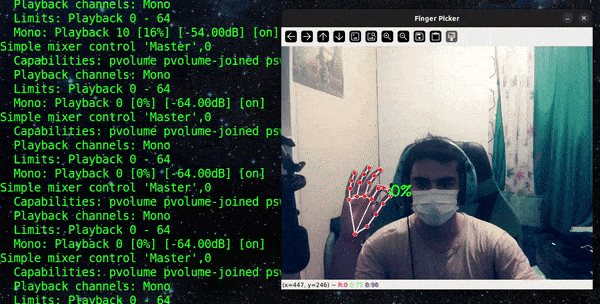

# Finger Remote Control (Volume)
- Adjusting the volume of the computer with two fingers remotely! :D



----------------------------------------------------------------
## Linux Users:
0. Run the following commands for install libraries (venv):
```console
pip install -r requirements.txt
```

1. Run the following commands for install system requirements:
```console
sudo apt-get install alsa-utils
```
```console
sudo apt-get install python3-tk python3-dev
```

2. Run `FVM_Linux.py` & enjoy!

> [!WARNING]
> If code doesn't run, try the following command:
> ```console
> sudo apt-get update
> sudo apt-get install libportaudio2
> ```

## Windows Users:
...
